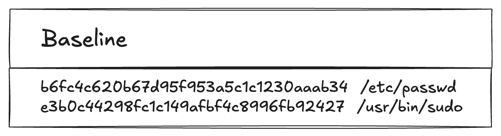
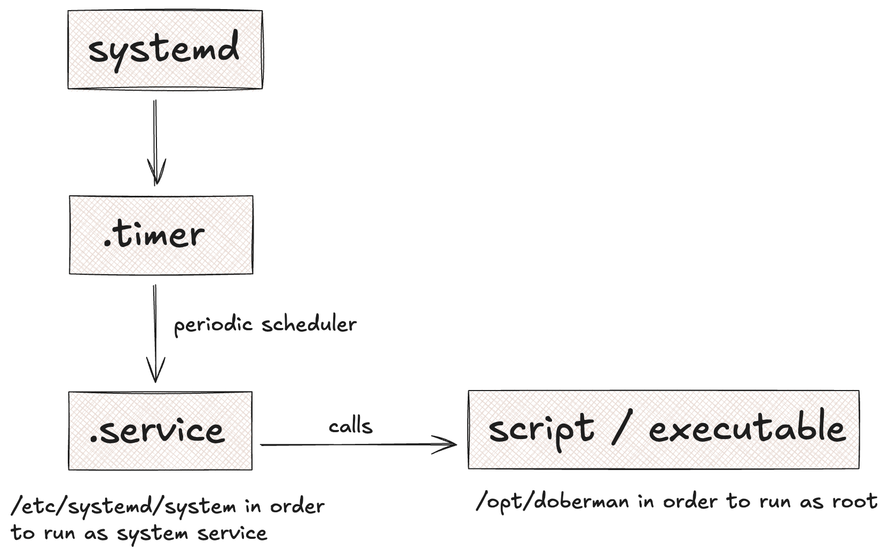
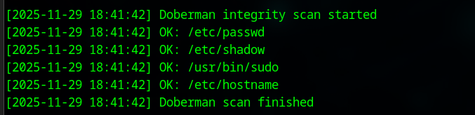

# Doberman File Integrity Monitor

*Doberman* is a file integrity monitor for Linux written in python. 

With *Doberman*, you can configure a list of files. These files will then be hashed and watched with a systemd service.

**Security goal:** ensure the integrity of critical files on your system.

## How it works

The `main` script reads the list of files in `doberman.config` file. 
Each file gets checked on the system, then hashed, then the hash with the filename is stored in `baseline.db` file.



*Doberman* runs as a systemd service which is scheduled via systemd timer (`.timer` file).



Since your critical files can only be accessed with `root`, *Doberman* needs to run as `root`.

### Logs

*Doberman* logs integrity checks to `/var/log/doberman/doberman.log`.
This file can be used to check integrity errors. 
Another service can be run to watch this log file and create alarms (e.g. crontab email alarms). 

## Installation

There is an installer script provided, which setup and runs *Doberman*.

**Note**: It's recommended to save the installer script in an appropriate location (e.g. `/home/root/tools/installer-scripts`).

```shell
curl -O https://raw.githubusercontent.com/kirillwolkow/doberman/main/install_doberman.sh
chmod +x install_doberman.sh
sudo ./install_doberman.sh
```

**Verify the setup**

```shell
systemctl status doberman.timer
systemctl status doberman.service
sudo tail -n 50 /var/log/doberman/doberman.log
```

With the last command, you should see something similar like:



### Uninstall

There is also an uninstaller script which removes everything related to *Doberman*.

```shell
curl -O https://raw.githubusercontent.com/kirillwolkow/doberman/main/uninstall_doberman.sh
chmod +x uninstall_doberman.sh
sudo ./uninstall_doberman.sh
```

## Baseline file Protection

The `baseline.db` file is the root of trust for your file integrity monitor.
If an attacker modifies it, they could hide their tampering from *Doberman*. 

### Use the `chattr`

To harden your system, you can protect the baseline database with the `chattr` command:

```shell
sudo chattr +i /opt/doberman/baseline.db

# confirm with
lsattr /opt/doberman/baseline.db
```

Applying the immutable flag to the baseline means:

- The file cannot be modified, not even by root
- The file cannot be deleted, renamed, replaced or overwritten

#### How to update/rebuild baseline

When legitimate changes occur, you must rebuild the baseline. 
There is a script provided for this. In order to do that, you need to temporarily remove the immutability.

```shell
sudo chattr -i /opt/doberman/baseline.db

# ... update your doberman.config file if needed
sudo python3 /opt/doberman/core/baseline.py
sudo chattr +i /opt/doberman/baseline.db
```

### Protect with private key

In case the account with which *Doberman* has been set up, is breached, it's possible to tamper the baseline file.

For better hardening, it's recommended to create a private key which lies externally (smartcard, yubikey etc.). 

TODO step-by-step guide
